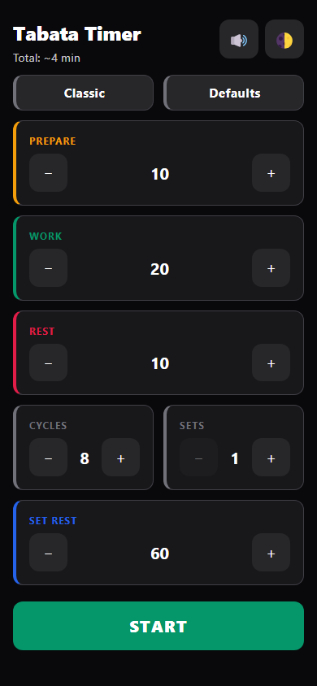
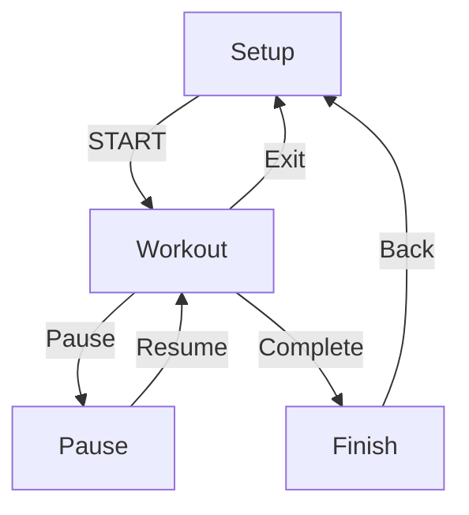

# Tabata Timer

A minimalist Tabata interval timer built with Vue 3, TypeScript, and Vite.

> **Minimal UI. Maximum focus during workouts.**

<p align="center">
  
</p>

<p align="center">
  <strong><a href="https://wolfzxcv.github.io/Tabata-Timer">Try it instantly in your browser — no installation required.</a></strong>
</p>

<p align="center">
  <a href="https://wolfzxcv.github.io/Tabata-Timer"></a>
  
  
  
  
  
</p>

## Why this project?

Most interval timers are either overloaded with features or cluttered by ads.

Tabata Timer focuses on a single goal:

A distraction-free, accurate workout timer that also serves as a reference implementation for modern Vue 3 web applications.

## Features

### Core

- Timestamp-based countdown (`performance.now()` — no drift from decrementing counters)
- Full-screen workout mode (running, pause overlay, completion screen)
- **Classic** preset (20s / 10s × 8) and **Defaults** reset (intervals only — keeps theme & mute)
- Settings persisted in `localStorage` (`tabata-settings`)
- Light / dark / auto theme on Setup screen

### Workout UX

- Audio countdown & phase transition beeps (square wave, gym-friendly volume)
- Mute toggle in Setup and during workout
- Celebration sound on workout complete
- Optional vibration on phase change
- Screen wake lock while active

### Developer

- Vue 3 Composition API + TypeScript composables (no Pinia / vue-router)
- PWA offline cache after first visit
- Vitest unit tests for core logic
- Full spec: [`spec.md`](./spec.md)

## Architecture

- No vue-router — state-driven `SetupView` / `WorkoutView` swap
- Immutable workout timeline (snapshot settings on START)
- Timestamp-based timer with catch-up on tab suspend
- Local composables only — no global store
- Completion derived from timeline index (`isComplete`), not a fourth status



## Development

```bash
npm install
npm run dev
npm run lint      # ESLint
npm run lint:fix  # auto-fix where possible
```

**IDE:** Use the [Vue - Official](https://marketplace.visualstudio.com/items?itemName=Vue.volar) extension (Volar), not Vetur.

## Testing

Vitest runs via `vite.config.ts` (`environment: jsdom`, `globals: true`).

```bash
npm test        # watch mode
npm run test:run
```

### What we test (and why)

| Layer                                              | Why                                             |
| -------------------------------------------------- | ----------------------------------------------- |
| `buildTimeline`, `parseSettings`, `formatDuration` | Pure functions — easiest to test, highest value |
| Timer timestamp helpers                            | Time accuracy is critical for a timer app       |
| `useTimerSettings`                                 | Defaults reset preserves theme/mute             |
| `NumberStepper`                                    | Basic component interaction and bounds          |

We intentionally skip WorkoutView pixel tests and real AudioContext output — balanced coverage, not 100% UI.

## Build & Deploy

```bash
npm run build
```

GitHub Pages base path is `/Tabata-Timer/`. Push to GitHub and deploy `dist/`, or use the included GitHub Actions workflow.

### Optional (maintainers only): Regenerate README screenshot

Not required for development or deployment. Playwright and Chromium are **not** project dependencies — install them only when you need to refresh `docs/screenshot.png`.

```bash
npm install --no-save playwright
npx playwright install chromium   # one-time; downloads ~100+ MB
npm run build
npm run preview                   # terminal 1 — keep running
node scripts/capture-screenshot.mjs   # terminal 2 — writes docs/screenshot.png
```

## Project structure

```
src/
├── components/     SetupView, WorkoutView (single canvas), NumberStepper
├── composables/    useTimer, useTimerSettings, useAudio, useWakeLock, useTheme
├── utils/          buildTimeline, parseSettings, formatDuration
├── styles/         global.css (setup theme tokens)
├── types/          shared TypeScript types
└── vite-env.d.ts   Vue SFC types for TypeScript / IDE
tests/              unit tests (mirrors src layout)
docs/               README screenshot (setup, dark theme)
scripts/            capture-screenshot.mjs — optional maintainer tooling (see above)
```

## License

MIT
